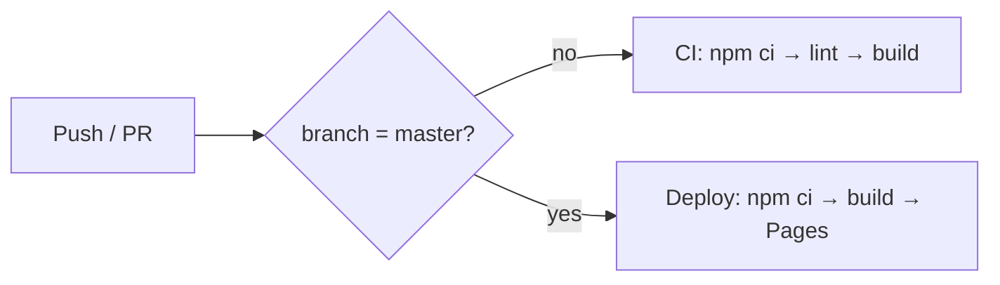

<div align="center">


# Fazri Gading · Portfolio

**Applied AI & Systems Engineer.** Two worlds in one scroll: a polished professional presence and a DedSec-inspired personal terminal.

[Live on GitHub Pages](https://fazrigading.github.io/portfolio/) · [Report an issue](https://github.com/fazrigading/portfolio/issues)

</div>

---

## What is this?

A static, two-worlds portfolio for Fazri Gading — Applied AI & Systems Engineer working at the intersection of deep learning, computer vision, and real systems.

The site commits to two completely separate skins behind a single split-scroll homepage:

| | Professional (`/pro/*`) | Personal (`/dev/*`) |
|---|---|---|
| **Audience** | Recruiters, hiring teams, research collaborators | Developer peers, friends, personal connections |
| **Grammar** | Editorial: big type, clean grids, solid backgrounds | DedSec terminal: CRT scanlines, glitch, wallpapers, ASCII |
| **Theme** | Dark by default, light toggle (persisted) | Single dark identity |
| **Nav** | Top rail with theme switch | SystemBar with `CTRL+K` palette hint |
| **Interactivity** | None — zero-JS pages | Terminal shell + command palette (2 React islands only) |

> The same writing, projects, and research appear in both zones — each rendered in its own grammar. There is no half-zine in the editorial world and no corporate tint in the terminal world.

## Architecture

- **Framework:** [Astro 7](https://astro.build) — static site generation, no client framework by default
- **Islands:** exactly two [React 19](https://react.dev) islands — `TerminalHero` (terminal shell) and `CommandPalette` (`Ctrl+K`). Everything else ships as zero-JS HTML.
- **Routing:** static multipage — one `.astro` file per route, no client-side router
- **Transitions:** Astro View Transitions on link navigation + [Lenis](https://github.com/darkroomengineering/lenis) smooth scroll, both gated on `prefers-reduced-motion`
- **Base path:** `/portfolio/` (GitHub Pages sub-path) — all links use `import.meta.env.BASE_URL`

### Tech stack

| Layer | Technology |
|---|---|
| Framework | Astro 7 + TypeScript 5.8 |
| Islands | React 19 (`TerminalHero`, `CommandPalette` — the only `.tsx`) |
| Styling | Tailwind CSS v4 (`@import "tailwindcss"`, no PostCSS config) |
| Content | MDX collections (`content/`) + JSON data (`src/data/*.json`) |
| Code blocks | Shiki (`github-dark`) |
| Icons | `lucide-react` + `simple-icons` via static `LucideIcon.astro` |
| Smooth scroll | Lenis (vanilla, no island) |
| Deployment | GitHub Pages (static `dist/`) |

### Route map

**Home**

| `/` | Split-scroll doorway. Scroll down to enter the Personal zone; a CTA enters the Professional zone. Remembers which door you walked through. |

**Professional zone**

| Route | Purpose |
|---|---|
| `/pro/about` | Editorial bio, method, strengths, tech stack, research profiles |
| `/pro/experience` | Work timeline + learning timeline + certifications |
| `/pro/research` | 6 Scopus-indexed papers (2 in Q1 journals), sorted by status |
| `/pro/projects` | 10 case studies, filterable by discipline |
| `/pro/blog` | Writing — systems, models, Linux desktops |
| `/pro/contact` | Direct email + external profile links |

**Personal zone**

| Route | Purpose |
|---|---|
| `/dev` | Terminal shell + fastfetch-style system readout + hub links |
| `/dev/games` | 47-game library wall with genre filter |
| `/dev/art` | Gallery (nature + objects) + literature shelves |
| `/dev/projects` | Payload index, filtered by PORT (80 / 443 / 8080 / …) |
| `/dev/blog` | Transmissions — same MDX, terminal grammar |

**Shared (zone-aware)**

| Route | Purpose |
|---|---|
| `/projects` | Redirect shim → `ZoneRedirect` sends you to the `/pro/` or `/dev/` version based on which side you entered from |
| `/blog/[...slug]` | Per-post redirect shim |

### Terminal & command palette

The Personal hub runs a working in-page shell (`TerminalHero.tsx`), driven by a single command registry in [`src/components/commands.ts`](./src/components/commands.ts):

```
help              show the command readout
goto <route>      jump to a route (letter shortcuts: d, g, a, p, b)
cat <file>        print a dossier file (about, roles, stack, contact)
accent <color>    switch theme color (blue, green, yellow, magenta, purple, red, pink)
clear             wipe the terminal
```

`Ctrl+K` opens the command palette in either zone — same verbs, same options, both surfaces.

## Getting started

```bash
git clone https://github.com/fazrigading/portfolio.git
cd portfolio
npm ci
npm run dev
```

Dev server starts on http://localhost:3000/portfolio/ — the base path is `/portfolio/` so the site 404s at server root by design.

### Commands

| Command | What it does |
|---|---|
| `npm run dev` | Start dev server on `:3000` (bound to `0.0.0.0`) |
| `npm run stop` | Stop the background dev server |
| `npm run build` | Production build → `dist/` |
| `npm run preview` | Preview the production build locally |
| `npm run lint` | TypeScript typecheck (`tsc --noEmit`) |
| `npm run clean` | Remove `dist/` |

> **Stale dev server trap:** after adding dependencies, stop the server (`npm run stop`), delete `node_modules/.vite` and `.astro`, then restart. A stale prebundle can serve a second React copy and trigger hydration errors.

## Project structure

```
src/
├── assets/           # wallpapers (desktop + mobile pools), profile image
├── components/       # 9 primitives (.astro) + 2 React islands + commands.ts + *Pref.ts + slug.ts
├── content/          # MDX collections: blog/, projects/, research/ (placeholder content)
├── data/             # JSON content: profile, pro, dev, experience, learning,
│                     #   research, projects, showcase, social, navigation
├── layouts/          # ProLayout.astro (editorial rail + theme toggle)
│                     #   DevLayout.astro (CRT scanlines + per-route wallpaper)
├── pages/            # routes: index, pro/*, dev/*, projects + blog redirect shims
├── styles/           # global.css (personal zone + route accents)
│                     #   pro.css (professional zone + light/dark themes)
└── content.config.ts # MDX collection schemas
public/
├── fonts/            # self-hosted webfonts (no external stylesheet)
├── txt/              # dossier files for terminal `cat`
├── game-covers/      # 47 Steam store covers
├── gallery/          # artwork placeholders (drop real files in)
├── covers/           # book covers
└── favicon.svg
```

## Editing content

The project is **data-driven** — content lives in JSON, not component files. Full guide in [`docs/data-guide.md`](./docs/data-guide.md).

- **`src/data/profile.json`** — name, roles, bio, tech stack, social stats, footer
- **`src/data/pro.json`** — Professional zone prose: headline, standfirst, positioning, metrics, roles, strengths, method, contact
- **`src/data/dev.json`** — Personal zone prose: ASCII banner, boot sequence, fastfetch status, hub links
- **`src/data/experience.json`** — Work + learning timeline entries
- **`src/data/learning.json`** — Certifications and bootcamps
- **`src/data/research.json`** — 6 publications with Scopus indexing and venue links
- **`src/data/projects.json`** — 10 projects with tech stacks and source links
- **`src/data/showcase.json`** — Gaming library (47 games), gallery placeholders, literature, music
- **`src/data/social.json`** — Social links, scholar profiles, gaming profiles
- **`public/txt/*.txt`** — Plain-text dossier files for terminal `cat` (kept in sync with JSON)
- **`src/content/blog/*.md`** — MDX posts (`title`, `slug`, `date`, `tags`, `excerpt`)

To add a blog post: drop a `.md` file in `src/content/blog/` with the frontmatter above, then run `npm run lint && npm run dev`.

To update any other content: edit the relevant JSON file — no page code changes needed.

## Design

Design tokens, route accents, font assignments, and the primitive catalog live in [`DESIGN.md`](./DESIGN.md). Styling conventions and the Tailwind v4 setup are documented in [`docs/styling.md`](./docs/styling.md). Architecture notes are in [`docs/architecture.md`](./docs/architecture.md).

### Professional zone

- **Fonts:** Bodoni Moda (headlines, serif accents), Archivo (hero + body), IBM Plex Mono (labels + data)
- **Palette:** deep ink ground, ivory page, champagne gold accent — dual dark/light theme persisted in `localStorage`
- **Motion:** View Transitions on navigation, reduced-motion respected

### Personal zone

- **Fonts:** VT323 (terminal display), Syne (card titles), JetBrains Mono (body + code)
- **Palette:** `<html data-route>` sets per-route accent vars (blue/green/yellow/magenta/purple/red/pink)
- **Effects:** CRT scanlines, hover-only glitch on display titles, halftone dot overlays, torn-paper card edges, per-route wallpaper pools — all display-only and motion-gated

## CI/CD



- **CI** (`.github/workflows/ci.yml`): all branches except `master` + PRs — `npm ci` → `npm run lint` → `npm run build` (Node 24)
- **Deploy** (`.github/workflows/deploy.yml`): push to `master` or manual dispatch — `npm ci` → `npm run build` → deploy `dist/` to GitHub Pages
